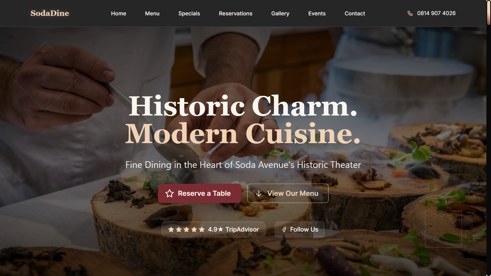

# SodaDine - Fine Dining Restaurant Website

SodaDine is a modern, visually appealing, and fully responsive frontend application for a fine dining restaurant. It was built with Next.js, TypeScript, and Mantine, and showcases a variety of features to attract and inform customers.



## The Story Behind SodaDine

This project was born from a desire to help a local restaurant in West Jefferson, NC, establish a strong online presence. I had a vision for a beautiful and functional website that would reflect the quality of their establishment. I developed the initial version of this application with that specific restaurant in mind.

Unfortunately, my attempt to pitch the idea was cut short. A brief phone call with the owner ended with a polite but firm, "Hey look, whatever it is you're selling, I'm not buying. Bye!" before I could even present my work.

Rather than letting the project go to waste, I decided to repurpose it into a template that any fine dining establishment could use. I've named it "SodaDine" as a placeholder, and it's now a testament to turning a moment of rejection into a creative opportunity.

This project is a showcase of what a modern restaurant website can be, and it's available for anyone to use and adapt for their own needs.

## Live Demo

You can see a live demo of the application here: [https://sodadine.vercel.app/](https://sodadine.vercel.app/)

## Features

- **Modern and Responsive Design:** A visually stunning and fully responsive design that looks great on all devices.
- **Interactive Hero Section:** An engaging hero section with a typing animation and calls to action.
- **Dynamic Menu:** A filterable menu with categories for appetizers, main courses, seafood, and desserts.
- **Chef's Specials:** A dedicated section to highlight the chef's signature dishes.
- **Online Reservations:** A user-friendly reservation form with date and time pickers.
- **Image Gallery:** A beautiful gallery to showcase the restaurant's ambiance and dishes.
- **Customer Testimonials:** A section for customer reviews and ratings.
- **Upcoming Events:** A list of special events, such as wine tasting and live jazz nights.
- **Contact Information:** A clear and concise contact section with a contact form and map.
- **Interactive Background:** A subtle, interactive particle background that adds a touch of elegance.

## Technologies Used

- **Framework:** [Next.js](https://nextjs.org/)
- **Language:** [TypeScript](https://www.typescriptlang.org/)
- **UI Framework:** [Mantine](https://mantine.dev/)
- **Styling:** [Tailwind CSS](https://tailwindcss.com/)
- **Icons:** [Tabler Icons](https://tabler-icons.io/)
- **Deployment:** [Vercel](https://vercel.com/)

## Getting Started

To get a local copy up and running, follow these simple steps.

### Prerequisites

- Node.js (v18 or later)
- pnpm (or npm/yarn)

### Installation

1.  Clone the repo
    ```sh
    git clone https://github.com/Nylite-soda/craftbistro.git
    ```
2.  Navigate to the project directory
    ```sh
    cd craftbistro
    ```
3.  Install dependencies
    ```sh
    pnpm install
    ```
4.  Run the development server
    ```sh
    pnpm dev
    ```

The application will be available at `http://localhost:3000`.

## Contributing

Contributions are what make the open-source community such an amazing place to learn, inspire, and create. Any contributions you make are **greatly appreciated**.

If you have a suggestion that would make this better, please fork the repo and create a pull request. You can also simply open an issue with the tag "enhancement".

1.  Fork the Project
2.  Create your Feature Branch (`git checkout -b feature/AmazingFeature`)
3.  Commit your Changes (`git commit -m 'Add some AmazingFeature'`)
4.  Push to the Branch (`git push origin feature/AmazingFeature`)
5.  Open a Pull Request

## License

Distributed under the MIT License. See `LICENSE` for more information.

## Contact

Oluwaseun Ajiboye - [Whatsapp](https://wa.me/+2348149074026) - [ajiboyeodavid@gmail.com](mailto:ajiboyeodavid@gmail.com)

Project Link: [https://github.com/Nylite-soda/craftbistro](https://github.com/Nylite-soda/craftbistro)
